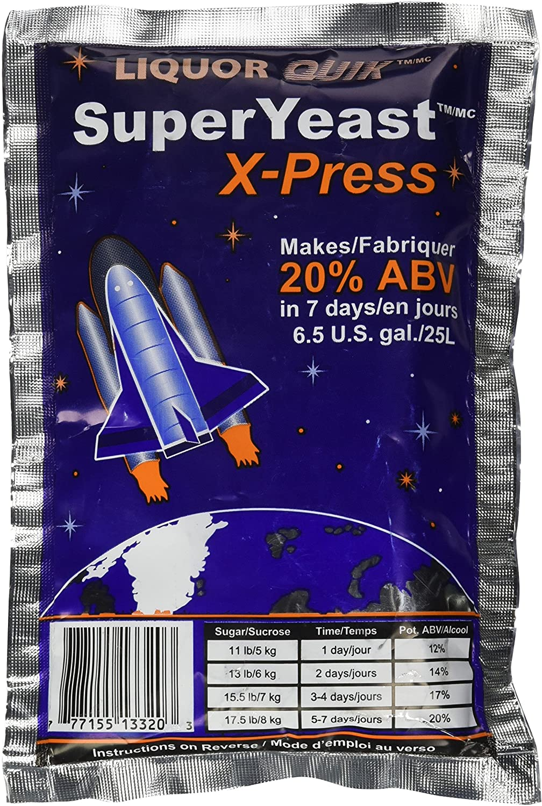
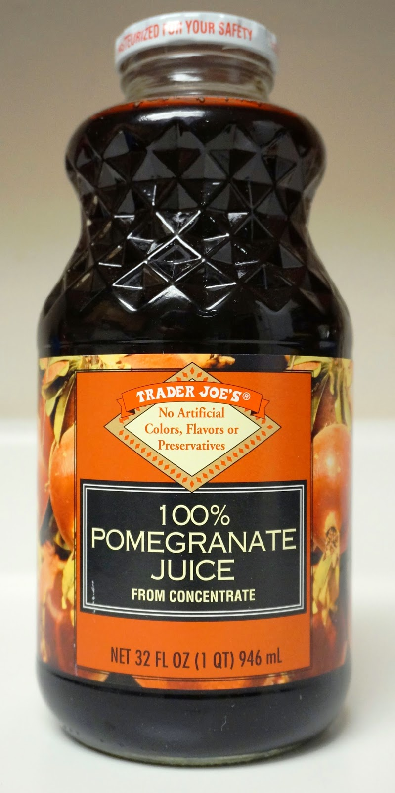

# DIY Fast Strong Pomegranate Wine

Recipe for simple homemade wine made from off-the-shelf juice and a special strain of yeast that makes wine relatively fast, ~1 week vs ~4-6 weeks, and relatively strong, ~15% (or higher with tweaks). I had success with Pomegranate juice, but you could substitute any type of not-too-acidic juice as long as you adjust the calculations linearly. (See notes.)

## Ingredients

-   6.3 g [SuperYeast X-Press](https://smile.amazon.com/gp/product/B071V8WH4L)
-   946 ml (32 oz) Trader Joe's Pomegranate juice at room temp
-   381 g sugar
-   500 ml water
-   64 oz growler (or other large brewing vessel)
-   [Star San](https://smile.amazon.com/gp/product/B00E5MXGKK/) (or similar) for sanitizing equipment
-   [Airlock](https://smile.amazon.com/gp/product/B00IGXQ5I4) (to vent CO2 while keeping out germs)
-   [Triple-scale hydrometer](https://smile.amazon.com/gp/product/B0735B5YND/) for measuring alcohol content (optional)

## Directions

1. **Very important!** Sanitize _all_ equipment. Mix water and sanitizer in a large pot or basin according to the instructions on the package. Use this sanitizer solution throughout process to sanitize equipment as needed.
2. Add juice to the growler
3. Add sugar to the growler
4. Cap and shake the growler until _all_ sugar is dissolved. This will take 5 minutes or more.
5. (Optional) Measure and record the specific gravity (SG) of the juice/sugar solution. You can use this value later to measure how much alcohol is in the wine throughout the fermentation process. Pour juice back into the growler when finished.
6. Add the yeast to the growler
7. Cap and _gently_ shake for at least 2 minutes
8. Add the airlock
9. Put the growler in a dark place like a closet
10. Gently agitate the wine once per day
11. Allow to ferment 3 - 10 days. The alcohol will continually increase until the yeast stops bubbling.
12. (Optional) Measure and record the SG at the end or throughout the brewing process and calculate the approximate alcohol content (ABV). ABV = (original SG - new SG) / 0.776
    - E.g., if my original SG was 1.112 and my final SG was 0.991, my ABV would be (1.112 - 0.991) / 0.776 = ~15.6% ABV

## Notes

In my batch, my starting specific gravity (SG) was 1.112. Here's how the alcohol content (ABV) increased over time:

-   **+4 days:** 1.018 SG = (1.112 - 1.018) / 0.776 = ~12.1% ABV
-   **+8d:** 1.008 SG = ~13.4% ABV
-   **+11d (final measurement)**: 0.991 SG = ~15.6% ABV

According to the package, the yeast calls for:

-   8 kg of sugar / 21 L of H2O = 381 g sugar / 1 L H20
-   135 g yeast / 21 L of H2O = 6.4 g / 1 L H2O

To use a different juice, the amount of sugar and yeast need to be adjusted:

1. Calculate the total weight of the juice. Zero a gram scale with the growler on it, and pour in all the juice.
    - Since juice is denser than water, its mass value should be greater than the volume. E.g., 946 ml might 1014 g.
2. Calculate the "water weight", the weight of the juice without the sugar stated on the label
    - E.g., if the label states 34 g of sugar, and the total weight is 1014 g, then the "water weight" would be 980 g.
3. Calculate the amount of sugar needed - E.g., if the water weight is 980 g, it is also 980 ml. The yeast calls for 381 g of sugar per 1000 ml of water, so the amount of sugar needed is (980 / 1000) _ 381 g = ~373 g, but we also need to subtract the sugar already in the juice, so the answer is 373 - 34 = 339 g of sugar
   4 Calculate the amount of yeast needed - E.g., again, if we have 980 ml of water, and the yeast calls for 6.4 g of yeast per 1000 ml of water, then we need (980 / 1000) _ 6.4 g = ~6.3 g
